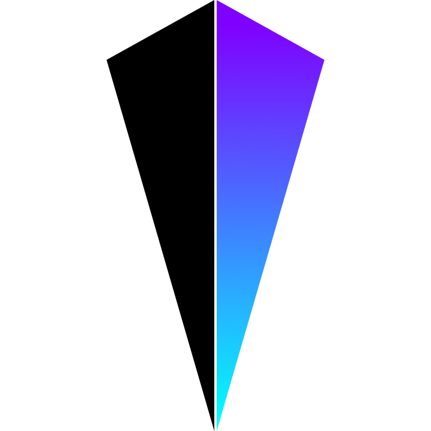
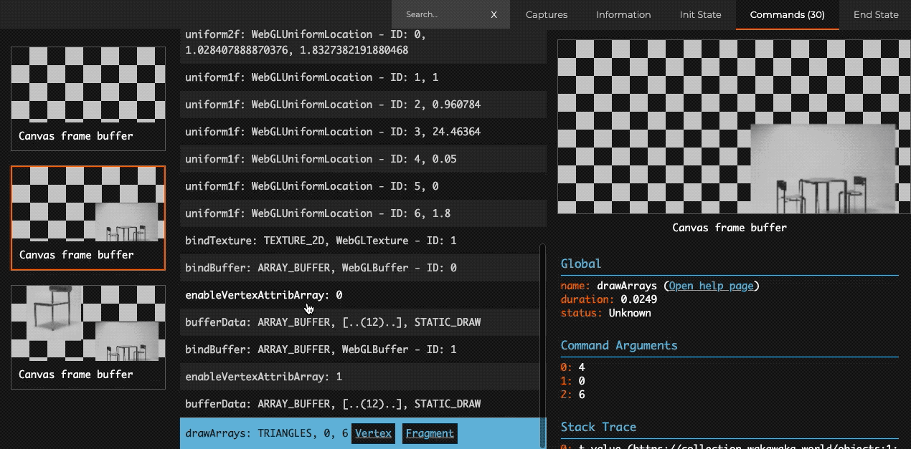
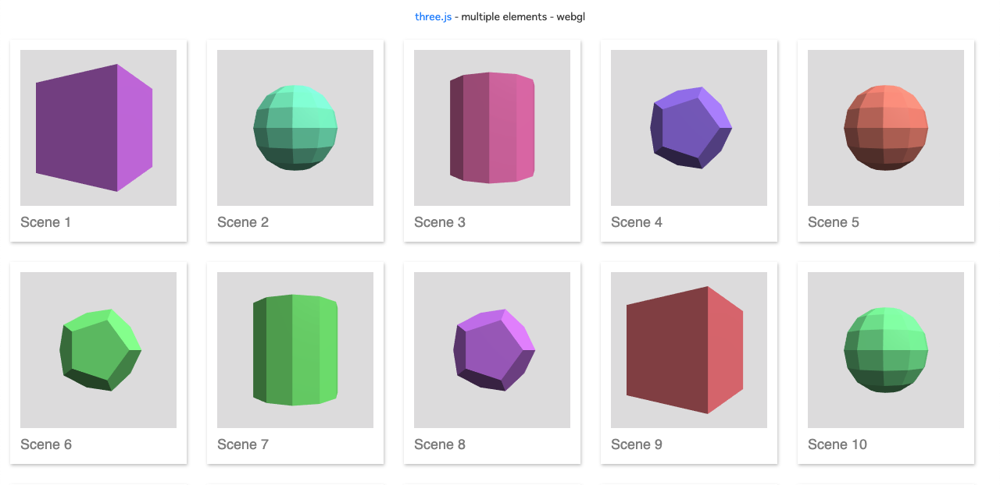
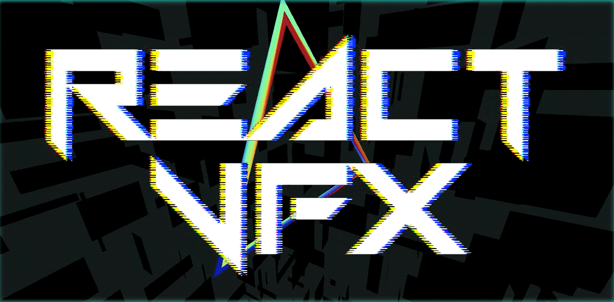

<!-- sectionTitle: 経緯 -->
<!-- classes: section-blue -->

import * as VFX from 'react-vfx'

<h1>
  <VFX.VFXDiv shader="rgbShift">経緯</VFX.VFXDiv>
</h1>

---

- ぼく「ポートフォリオ作りたいな〜」
- ぼく「参考に[AWWWARDS](https://www.awwwards.com/)でもみるか」
  - 僕はChromeに[Panda](https://usepanda.com/)入れてます

---

この画像エフェクトかっこいいな〜

---

かっけ〜！

---

## 僕の[VEDAJS](https://github.com/fand/vedajs)で作れるかな？

- WebGL(GLSL)でアニメーションを描画するライブラリ
- 要素の数だけcanvasを生成する必要があり、非効率
- WebGL contextの数に上限アリ([ソース](https://www.reddit.com/r/firefox/comments/7m6iph/webgl_context_limit/))

---

## Spector.jsで見てみる

- [BabylonJS](https://github.com/BabylonJS/Babylon.js)チームによるWebGLデバッグツール
- どういう順番で描画命令とかテクスチャを見れる

---

---

## Devtools見た結果

- ページ全体にcanvas一枚
- 画像ごとに描画されてる
- Three.jsの場合、画像毎にシーン作って 
  viewport設定して描画すれば良さそう

---

参考: Three.jsのexample

---

<!-- classes: section-red -->

## できました

