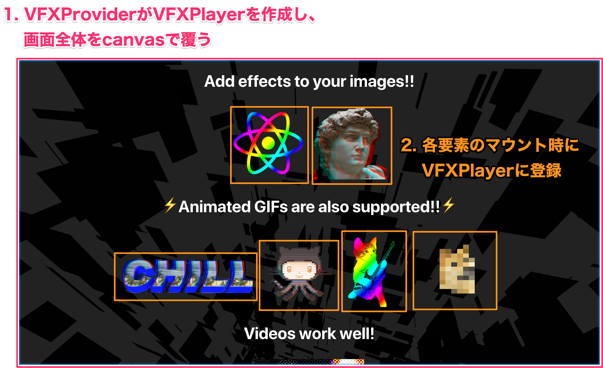

<!-- sectionTitle: 仕組み -->
<!-- classes: section-blue -->

# react-vfxの仕組み

---

## 登場人物

- VFXPlayer: シーン管理、描画
- VFXProvider: canvas生成、Player初期化
- VFXElement: img等のラッパー

---

## 処理の流れ

- 1. VFXProviderがcanvasを生成
- 2. Elementsのマウント時に登録
- 3. メインループ
  - 要素の位置を更新
  - 画面内の要素を描画

---



---

## 1. VFXProvider

- 画面全体を覆うcanvasを生成
- VFXPlayerを初期化
  - Three.js周りを管理するクラス
- ContextにVFXPlayerを渡す

---

hooks便利〜

```javascript
const VFXContext = createContext(null);

const VFXProvider = props => {
  const [player, setPlayer] = useState(null);

  useEffect(() => {
    // 中略

    const p = new VFXPlayer(canvas)
    setPlayer(p);

    // 中略
  }, []);

  return (
    <VFXContext.Provider value={player}>
      {props.children}
    </VFXContext.Provider>
  );
};
```

---

## VFXElements

- マウント時にVFXPlayerに登録
- 要素に応じてTextureを作成
  - img, video: そのままThree.jsに渡す
    - WebGLはvideo要素から直接テクスチャ作れて最高！
  - span, div: 気合で画像に変換（後述）

---

hooks便利〜

```javascript　
const VFXImg = props => {
  const { shader } = props;
  const player = useContext(VFXContext);
  const ref = useRef(null);

  const init = useCallback(() => {
    // VFXPlayerに登録
    player?.addElement(ref.current, { shader });

    return () => {
        // VFXPlayerから削除
        player?.removeElement(ref.current);
    };
  }, [shader, player]);

  return ;
};
```

---
import * as VFX from 'react-vfx';

## 3.メインループ

- 各要素の要素の位置を毎フレーム取得
  - 画面内にあれば、その位置にテクスチャを描画
  - <b><VFX.VFXDiv shader="rainbow">まあまあ重いけど動くからヨシ！</VFX.VFXDiv></b>
- IntersectionObserverも試したけど微妙だった
  - コールバックの実行がたまに遅れる(？)
  - 遅延ロード等に使われるAPIだから仕方ない……

---
　　
## テキストを画像に変換

- 当初は[html2canvas](https://html2canvas.hertzen.com/)を使用
- 遅い上に無駄なリクエストが走りまくるので断念
  - キャプチャするたびにページ全体をクローンする仕組みのため
  - 正確にスタイルを再現するには<br/>
    ページ全体をクローンする必要があるので仕方ない

---

- 今回は、最低限プレーンテキストが画像化できれば良い
- SVGのforeign objectを使う
  - html2canvasの中身で使ってる奴

TODO: foreignObjectについて書く

---

できた

TODO: ここにdom2canvasの画像を貼る

---

## dom2canvasの困りごと

- 子要素があるとおかしくなる
- 微妙にズレたりズレなかったりする
  - html2canvasでもズレてたので改善ムズそう
- 改行するとおかしくなる
- CORS周り
  - TODO: 詳細を調べて書く

……etc
